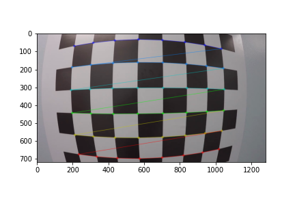
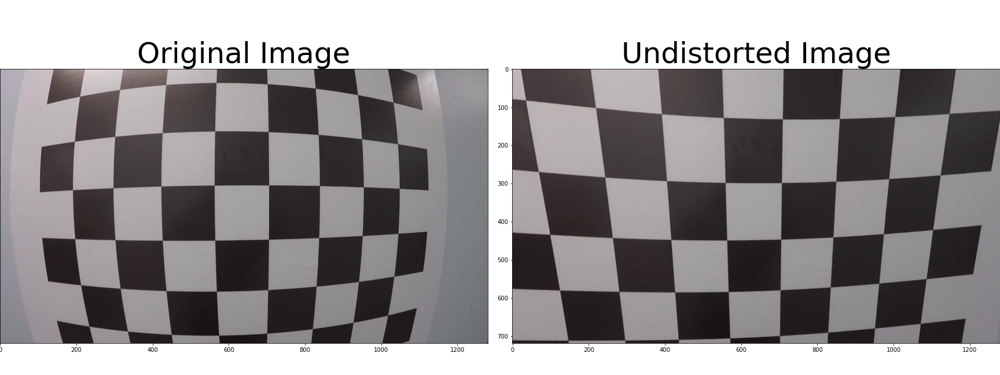

# Camera_Calibration
There are two main steps to this process: use chessboard images to obtain image points and object points, and then use the OpenCV functions cv2.calibrateCamera() and cv2.undistort() to compute the calibration and undistortion.

**Extract Object Points & Image Points**

**Camera Calibration & Distortion Correction**

**Undistort and Transform Perspective**

